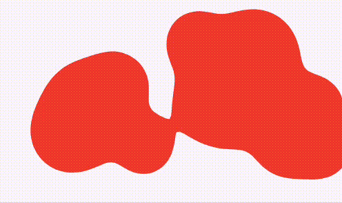

# Lava Lamp Effect

A Flutter package that provides a customizable lava lamp effect with fluid animations, adjustable colors, sizes, and
speeds.

[](https://pub.dev/packages/lava_lamp_effect)

This package is inspired by [flutter_lava_clock](https://github.com/jamesblasco/flutter_lava_clock) and has been updated
to be compatible with the latest Flutter and Dart versions.

## Demo



## Features

- Fluid, organic lava lamp animation
- Customizable colors
- Adjustable size
- Control over the number of lava blobs
- Configurable animation speed
- Works on all platforms (Android, iOS, web, desktop)

## Installation

Add this to your package's `pubspec.yaml` file:

```yaml
dependencies:
  lava_lamp_effect: ^1.0.0
```

Then run:

```bash
flutter pub get
```

## Usage

Import the package:

```dart
import 'package:lava_lamp_effect/lava_lamp_effect.dart';
```

Basic usage:

```dart
// Create a basic lava lamp effect
Widget buildLavaLamp() {
  return const LavaLampEffect(
    size: Size(300, 500),
  );
}
```

Customized usage:

```dart
// Create a customized lava lamp effect
Widget buildCustomLavaLamp() {
  return const LavaLampEffect(
    size: Size(300, 500),
    color: Colors.purple,
    lavaCount: 6,
    speed: 2,
    repeatDuration: Duration(seconds: 15),
  );
}
```

### Example

```dart
import 'package:flutter/material.dart';
import 'package:lava_lamp_effect/lava_lamp_effect.dart';

void main() {
  runApp(const MyApp());
}

class MyApp extends StatelessWidget {
  const MyApp({super.key});

  @override
  Widget build(BuildContext context) {
    return MaterialApp(
      home: Scaffold(
        appBar: AppBar(
          title: const Text('Lava Lamp Effect Demo'),
        ),
        body: Center(
          child: LavaLampEffect(
            size: const Size(300, 500),
            color: Colors.deepPurple,
            lavaCount: 4,
            speed: 1,
            repeatDuration: const Duration(seconds: 10),
          ),
        ),
      ),
    );
  }
}
```

## API Reference

### LavaLampEffect

| Parameter      | Type     | Default            | Description                                         |
|----------------|----------|--------------------|-----------------------------------------------------|
| size           | Size     | required           | The dimensions of the lava lamp effect              |
| color          | Color?   | Theme.primaryColor | The color of the lava blobs                         |
| lavaCount      | int      | 4                  | The number of lava blobs in the animation           |
| speed          | int      | 1                  | The speed of the animation (higher values = faster) |
| repeatDuration | Duration | 10 seconds         | The duration of one complete animation cycle        |

## Contributing

Contributions are welcome! If you find a bug or want a feature, please open an issue on
the [GitHub repository](https://github.com/yashas-hm/lava-lamp-effect).

## License

This project is licensed under the MIT License, see the LICENSE file for details.

## Credits

This package is inspired by [flutter_lava_clock](https://github.com/jamesblasco/flutter_lava_clock) by Jaime Blasco.
